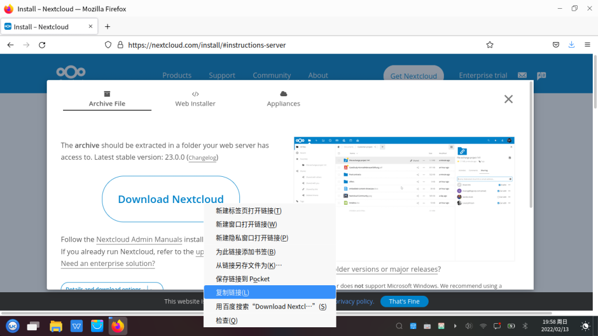

# UbuntuKylin 20.24 Pro SP1操作系统上的宝塔面板搭建Nextcloud私有云
## 搭建环境
### 1.安装UbuntuKylin
  自行去[优麒麟官网](https://www.ubuntukylin.com/)上下载镜像并安装，这里就不多说了。

### 2.安装宝塔面板
  进入[宝塔面板官网](https://bt.cn/)查看教程，自行安装。
## 搭建私有云
### 1.下载Nextcloud
来到Nextcloud官网的下载界面，找到并点击`COMMUNITY PROJECTS`，在`Archive`复制下方的`Get ZIP file`包含的链接。
{ loading=lazy }

