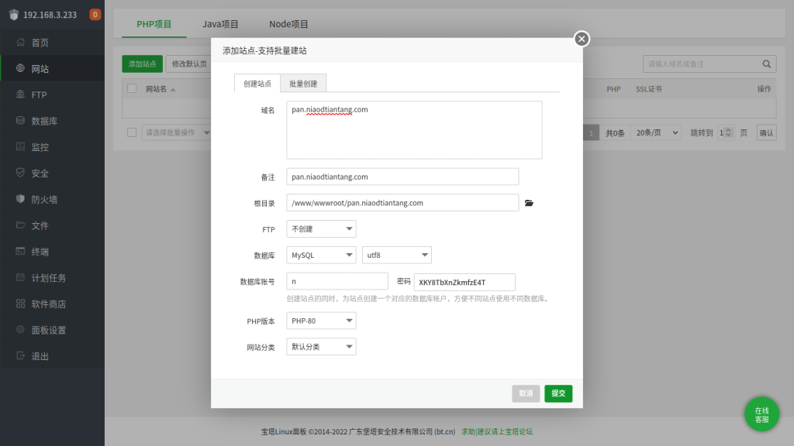
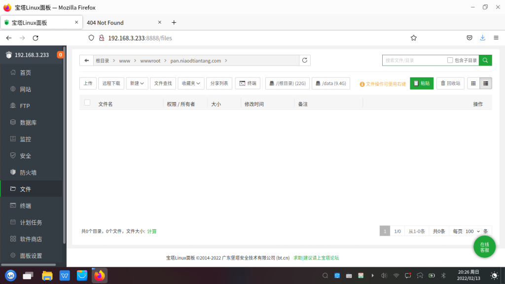

# UbuntuKylin 20.24 Pro SP1操作系统上的宝塔面板搭建Nextcloud私有云

***

<em>2022-01-26</em>

## 搭建环境

### 1.安装UbuntuKylin
自行去[优麒麟官网](https://www.ubuntukylin.com/)上下载镜像并安装，这里不在赘述。

### 2.安装宝塔面板

进入[宝塔面板官网](https://bt.cn/)查看教程，自行安装。

## 搭建私有云

### 1.下载Nextcloud

来到Nextcloud官网的下载界面，找到并点击`COMMUNITY PROJECTS`，在`Archive`复制下方的`Get ZIP file`包含的链接。

{ loading=lazy }

进入宝塔面板，点击文件，再点击远程下载，将刚才的链接粘贴至URL框中。

{ loading=lazy }

### 2.安装
在宝塔面板中点击网页，并创建一个网页和数据库。
???+ "温馨提示"
  请记住数据库账号以及密码。
{ loading=lazy }
解压下载的压缩包。
{ loading=lazy }
进入解压后文件夹后，将全部文件复制，
{ loading=lazy }
并粘贴至网站的根目录。
{ loading=lazy }
访问你的站点，设置自己的管理员账号密码，并输入相关信息。
{ loading=lazy }
{ loading=lazy }
然后点击安装完成进行安装。
{ loading=lazy }
安装完成后，即可尽情享受私有云的快乐了。
