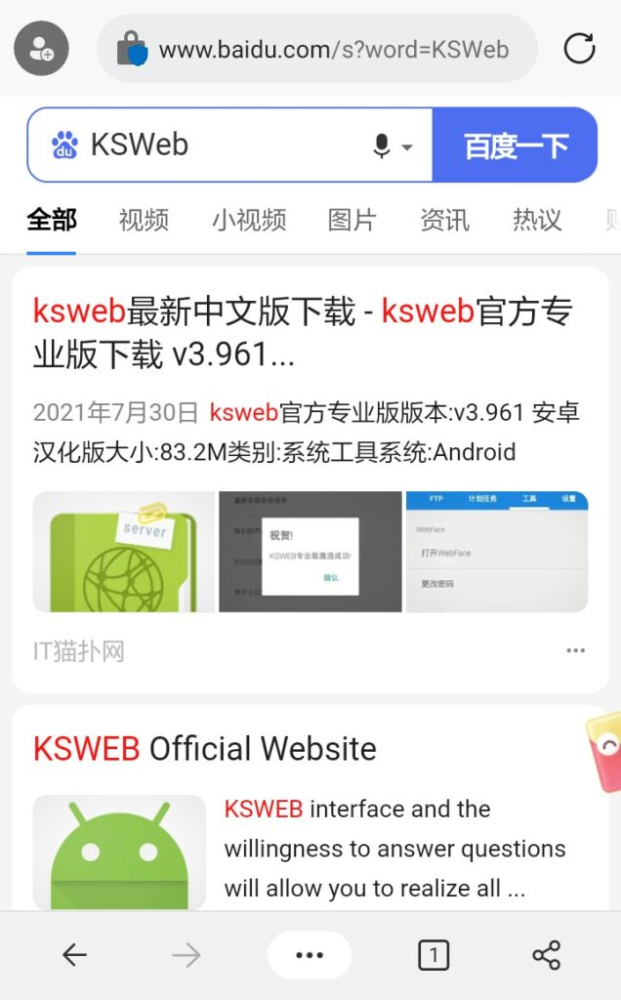

# 使用安卓手机通过KSWEB搭建服务器

`
家里的旧手机闲着没有用？教你在安卓系统上搭建服务器！
`

## 步骤
### 1.下载KSWEB的安装包并安装
进入[KSWEB官网](http://www.kslabs.ru/)或百度搜索KSWEB下载安装包。

{ loading=lazy }

下载完成后，安装KSWEB。

{ loading=lazy }
{ loading=lazy }

### 2.使用
安装好以后，就可以将自己的文件放到目录内，搭建自己的网站。
