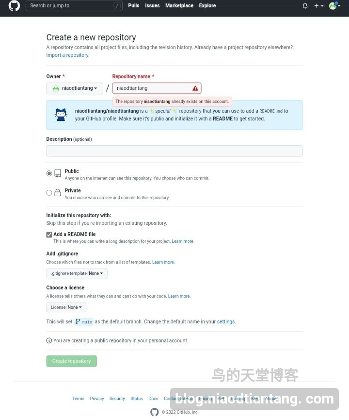
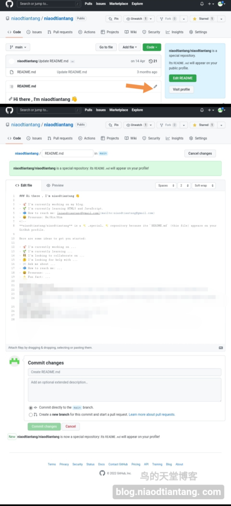
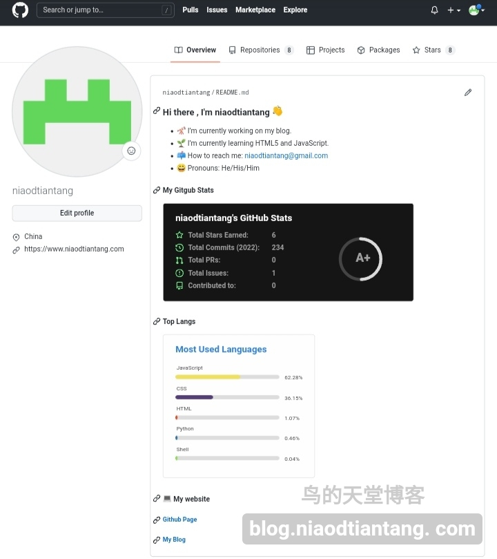

# 玩转github的个人主页

## 准备

### 1.注册[GitHub](http://www.github.com)账号

自己去注册这里就不多说了。

### 2.创建与用户名同名仓库

进入：[github.com/new](http://www.github.com/new/)创建仓库，“Repository name”填你的GitHub用户名，并勾选“Add a README file”。

## 编辑

打开新创建的仓库，编辑“README.md”并保存。“# ”带表H1(标题1)，“## ”带表H2(标题2)，以此类推，注意后面有空格。

## 看看效果

