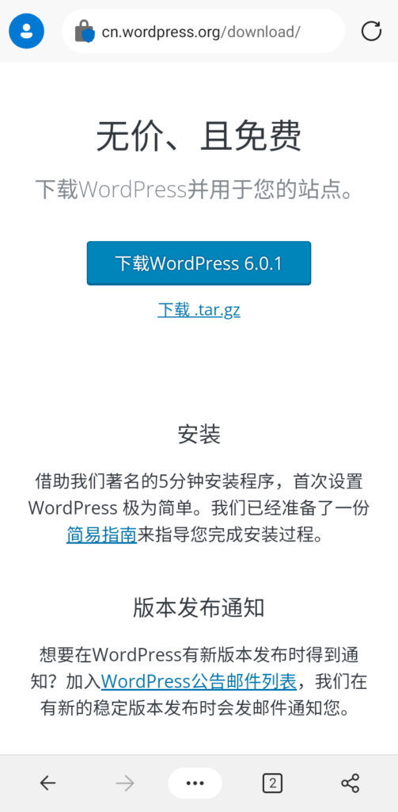
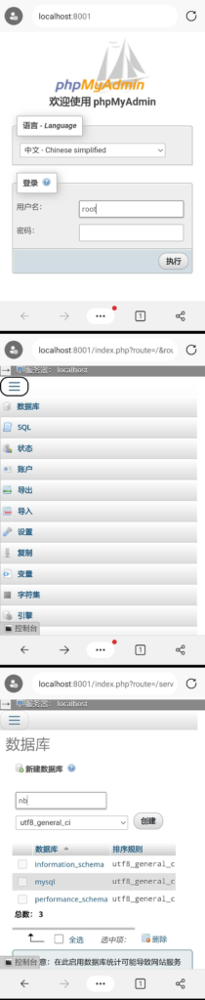
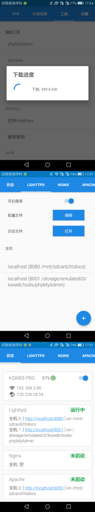
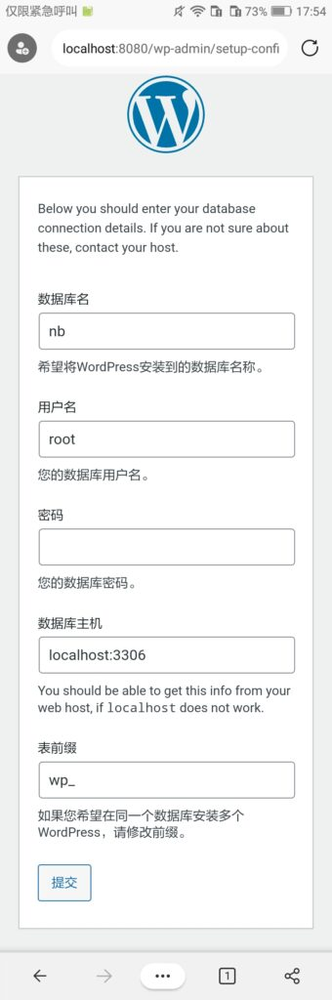
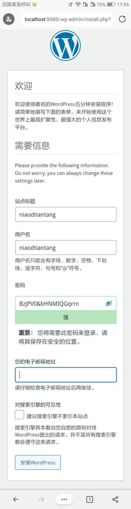
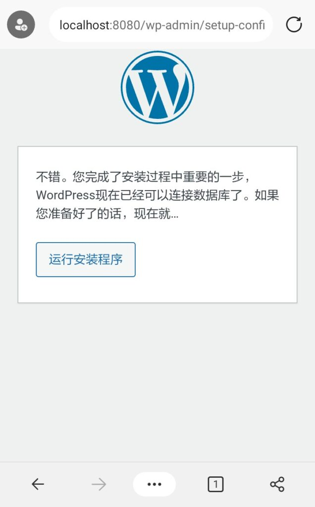
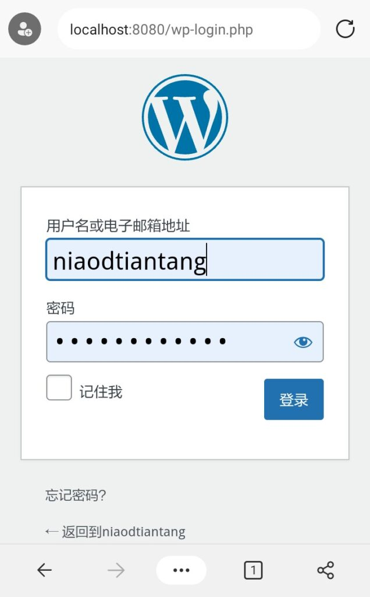
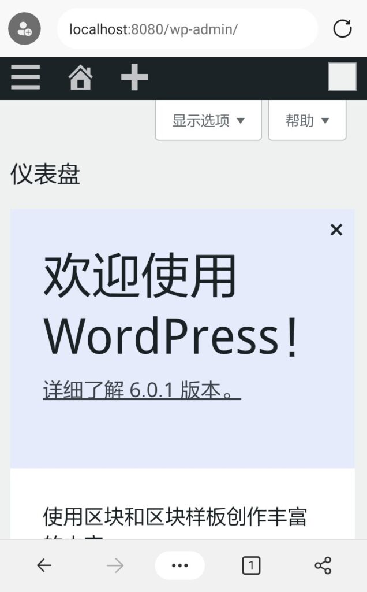
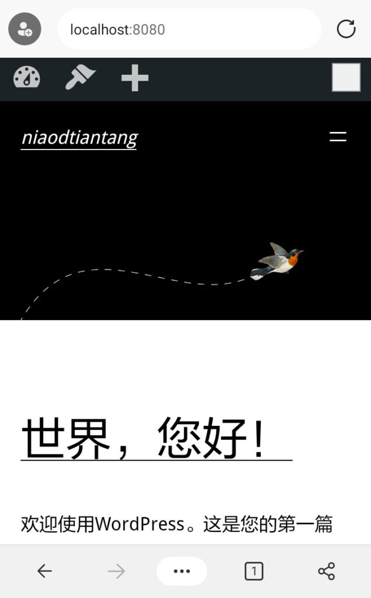

# 利用KsWeb搭建WordPress博客

***

<em>2022-08-01</em>

## 准备工作

### 1.安装KsWeb

参见:

[使用安卓手机通过KSWEB搭建服务器](4.md)

### 2.下载WordPress

进入[WordPress官方网站的下载界面](https://cn.wordpress.org/download/)下载。

### 3.配置数据库

#### ①配置phpMyAdmin

进入Ksweb，在上方的Tab选项卡中找到并点击“MySql”、“PHP”，并开启此服务；在上方的Tab选项卡中找到并点击“工具”，在下方的辅助工具中找到并点击“phpMyAdmin”，选择一个服务器程序后点“确定”(这里选择LIJHPPTD)，等待下载完成后你会发现你选择的服务多了一个主机，我们开启该服务。

#### ②添加数据库

在ksweb主页点击新添加主机旁边的链接，在浏览器打开。出现登录界面后进行登录 ，默认账户为“root”密码为空。

登录完成后，点击左上角的菜单，点击数据库。加载完成后在上方的文本框中输入数据库名称，点击创建。

## 安装

进入ksweb，开启LIJHPPTD、MySql、php服务(方法与之前一样)。在主页点击lijhpptd下的“主机0”(默认的)旁边的链接，在浏览器中打开。之后会自动来到一下界面，我们点击“现在就开始！”。

然后填上信息。数据库名填刚才创建的数据库名，用户名填“root”，密码为空（如果修改了密码就填新的密码），数据库主机填“localhost:3306”（更改过端口的将“3306”改为更改后的端口），表前缀保持默认，之后提交。

输入站点的信息和管理员邮件、用户名、密码，然后点击“安装WordPress”。

点击运行安装程序，然后耐性等待并按提示操作。

## 完成

安装完成后会提示你来到登录界面（你的站点URL/wp_login.php）。输入管理员电子邮件（用户名）和刚刚设置的密码即可登录。

## 效果图

